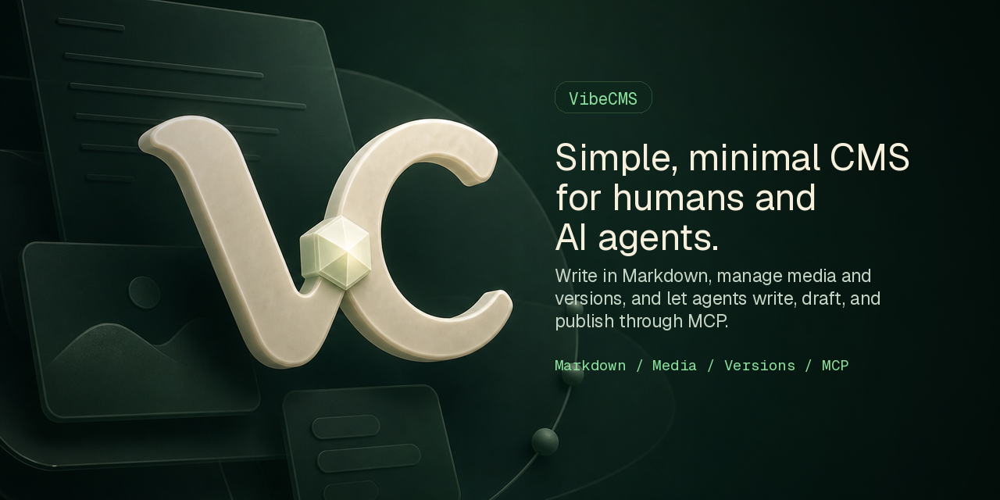

# VibeCMS



CMS for humans and AI agents.

Write in Markdown, manage media and versions, and let agents write, draft, and publish through MCP. REST stays read/list, every mutation creates activity, and meaningful post changes create versions.

## Features

- Clean hosted blog dashboard
- Public blog pages
- Markdown post editor
- R2 media uploads
- D1 database
- Activity history
- Post version history
- Scoped agent tokens with `vc_` prefixes
- MCP endpoint for trusted agents
- Polar billing for hosted VibeCMS Cloud
- `SELF_HOSTED=true` mode without Polar

## Connect an MCP client

VibeCMS exposes MCP over normal HTTPS. Create a scoped token in **Settings → Agent Access Token**, then give your agent:

```txt
MCP URL: https://your-vibecms-domain.com/mcp
Authorization: Bearer vc_...
```

Direct HTTP MCP clients can use this shape:

```json
{
  "mcpServers": {
    "vibecms": {
      "type": "http",
      "url": "https://your-vibecms-domain.com/mcp",
      "headers": {
        "Authorization": "Bearer vc_..."
      }
    }
  }
}
```

Verify the endpoint:

```sh
curl https://your-vibecms-domain.com/mcp \
  -H "Content-Type: application/json" \
  -H "Authorization: Bearer vc_..." \
  --data '{"jsonrpc":"2.0","id":1,"method":"tools/list","params":{}}'
```

Use REST only for read/list access:

```sh
curl https://your-vibecms-domain.com/api/posts \
  -H "Authorization: Bearer vc_..."
```

Some older MCP clients only accept local stdio servers. Use an HTTP-to-stdio bridge for those clients only; the VibeCMS integration itself is just HTTPS plus the bearer token.

## License

VibeCMS is licensed under AGPL-3.0-or-later. See `LICENSE`.

The VibeCMS name and marks are covered by the trademark guidelines in `TRADEMARKS.md`.

## Scripts

```sh
pnpm install
pnpm typecheck
pnpm lint
pnpm public:audit
pnpm db:migrate:local
pnpm db:seed:local
pnpm dev
```

Database migration SQL lives in `packages/db/drizzle/0001_initial.sql` and is wired to the web worker's D1 binding.

See `MILESTONES.md` for the milestone-by-milestone build plan and acceptance checks.

## Self-host mode

VibeCMS now has a real self-host switch:

```txt
SELF_HOSTED=true
```

In self-host mode, Polar is optional and billing gates are disabled. After signup and blog setup, the owner lands directly on `/app`; publishing, media uploads, scoped agent access, activity history, and post versions run on the self-hoster's Cloudflare D1/R2 resources.

The repo is intentionally set up as **one repository** for both VibeCMS Cloud development and self-hosted deploys:

- `apps/web/wrangler.jsonc` is the private/dev hosted Worker config.
- `wrangler.jsonc` at the repo root is the public self-host Deploy-to-Cloudflare config.
- `pnpm deploy` uses the root self-host config, applies D1 migrations by binding name (`DB`), and deploys the built Worker.

Deploy button shape, once this repo is public:

```md
[](https://deploy.workers.cloudflare.com/?url=https://github.com/moinulmoin/vibecms)
```

During deploy, set the root `wrangler.jsonc` vars to your deployed Worker URL:

```txt
APP_URL=https://<your-worker>.<your-subdomain>.workers.dev
BETTER_AUTH_URL=https://<your-worker>.<your-subdomain>.workers.dev
PUBLIC_BLOG_DOMAIN=<your-worker>.<your-subdomain>.workers.dev
SELF_HOSTED=true
```

The only required self-host secrets are listed in `.dev.vars.example`:

```txt
BETTER_AUTH_SECRET=<generate with openssl rand -hex 32>
TOKEN_PEPPER=<generate with openssl rand -hex 32>
```

Minimal local/self-host env shape:

```txt
APP_URL=http://localhost:5173
BETTER_AUTH_URL=http://localhost:5173
PUBLIC_BLOG_DOMAIN=localhost
SELF_HOSTED=true
BETTER_AUTH_SECRET=<generate with openssl rand -hex 32>
TOKEN_PEPPER=<generate with openssl rand -hex 32>
```

See `docs/self-hosting.md` for the Cloudflare self-host flow and deploy-button notes.

## Launch notes

- Configure Cloudflare D1/R2 IDs in `apps/web/wrangler.jsonc` before production deploy.
- Set secrets with Wrangler: `BETTER_AUTH_SECRET`, `TOKEN_PEPPER`, `POLAR_ACCESS_TOKEN`, and `POLAR_WEBHOOK_SECRET`.
- Set `POLAR_PRODUCT_ID`, `POLAR_SERVER`, `APP_URL`, `BETTER_AUTH_URL`, and `PUBLIC_BLOG_DOMAIN` for the deployed environment.
- Apply D1 migrations before deploy: `pnpm --filter @vc/web exec wrangler d1 migrations apply vibecms_dev --remote`.
- Custom domains are intentionally deferred from the MVP; the schema supports domain rows, but hostname provisioning/status checks should ship as a dedicated follow-up.

For self-hosted production, set `SELF_HOSTED=true` and only `BETTER_AUTH_SECRET` plus `TOKEN_PEPPER` are required as secrets; Polar access token/product/webhook secrets are hosted-SaaS only.

## Dev deployment

Current Cloudflare dev resources are wired in `apps/web/wrangler.jsonc`:

- Worker: `vibecms`
- URL: `https://vibecms.moinulislammoin2019.workers.dev`
- D1 database: `vibecms_dev`
- R2 bucket: `vibecms-assets`

Run the full dev deploy/test flow:

```sh
pnpm install
pnpm typecheck
pnpm lint
pnpm db:seed:dev
pnpm deploy:dev
BASE_URL=https://vibecms.moinulislammoin2019.workers.dev pnpm test:smoke
```

`pnpm deploy:dev` applies remote D1 migrations through the Wrangler `DB` binding, builds the RedwoodSDK worker, and deploys it. `pnpm release:dev` is also available when you want RedwoodSDK's interactive `rw-scripts ensure-deploy-env` release flow.

For Polar billing, create a sandbox product in Polar and update:

```sh
# In apps/web/wrangler.jsonc, replace product_dev_placeholder:
# "POLAR_PRODUCT_ID": "<your Polar sandbox product id>"

pnpm --filter @vc/web exec wrangler secret put POLAR_ACCESS_TOKEN
pnpm --filter @vc/web exec wrangler secret put POLAR_WEBHOOK_SECRET
pnpm deploy:dev
```

Recommended sandbox product setup:

- Recurring subscription product.
- Price: $9/month, or $99/year if you create a yearly product/price in Polar.
- 7-day free trial in Polar, card required.
- Use the monthly product for `POLAR_MONTHLY_PRODUCT_ID` or the legacy `POLAR_PRODUCT_ID`. If yearly is a separate Polar product, set it as `POLAR_YEARLY_PRODUCT_ID`; otherwise yearly checkout falls back to the monthly product.
- In hosted mode, new workspaces stay behind the Polar checkout gate until checkout/webhooks mark billing active. In self-host mode, `SELF_HOSTED=true` bypasses billing gates entirely.
- Launch entitlement: 1 hosted blog, unlimited posts, 500MB media during trial, 5GB media after subscription, scoped agent access, activity history, and post version history.
- Upload policy enforced by the app: JPEG/PNG/WebP/GIF only, 10MB max image size, no video hosting, no generic file hosting.

Recommended minimum Polar organization access token scopes:

- `checkouts:write` for creating checkout sessions.
- `customer_sessions:write` for creating customer portal sessions.

You do not need product, order, refund, file, meter, webhook, or subscription write scopes for the current app runtime. Webhooks are verified with `POLAR_WEBHOOK_SECRET`, not the API token.

In Polar, set the webhook endpoint to:

```text
https://vibecms.moinulislammoin2019.workers.dev/polar/webhook
```

Subscribe to these webhook events:

- Required: `subscription.created`, `subscription.updated`, `subscription.active`, `subscription.past_due`, `subscription.canceled`, `subscription.revoked`.
- Required for checkout/customer reconciliation fallback: `checkout.updated`.
- Optional but useful for analytics later: `order.paid`.

The app currently updates billing state from `subscription.*` payloads and from successful `checkout.updated` payloads. Keep the webhook delivery format as raw JSON and copy the endpoint signing secret into `POLAR_WEBHOOK_SECRET`.
