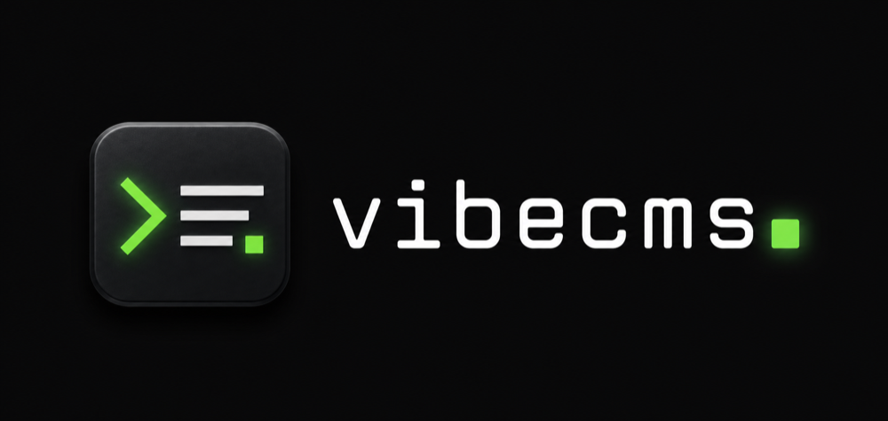

<div align="center">
  
  <p><strong>CMS for AI Agents.</strong></p>
</div>


Write in Markdown, manage media and versions, and let agents write, draft, and publish through MCP or the REST `/api/v1` API. Every mutation creates activity, and meaningful post changes create versions.

## Features

- Clean hosted blog dashboard
- Public blog pages
- Markdown post editor
- R2 media uploads
- D1 database
- Activity history
- Post version history
- Scoped agent tokens with `vc_` prefixes
- MCP endpoint for trusted agents
- Polar billing for hosted vibecms Cloud
- `SELF_HOSTED=true` mode without Polar

## Connect an MCP client

vibecms exposes standards-based MCP over Streamable HTTP. In the dashboard, open **Connect**, create a scoped token, and copy it once.

Claude Code is the primary example:

```sh
claude mcp add --transport http vibecms https://your-vibecms-domain.com/mcp \
  --header "Authorization: Bearer vc_..."
```

Any compatible MCP client uses the same endpoint and bearer credential:

```json
{
  "mcpServers": {
    "vibecms": {
      "type": "http",
      "url": "https://your-vibecms-domain.com/mcp",
      "headers": {
        "Authorization": "Bearer vc_..."
      }
    }
  }
}
```

Install the client-independent safety and writing skills:

```sh
npx skills add moinulmoin/vibecms --skill vibecms-core --skill vibecms-writing
```

Verify credentials with a protected read—not `tools/list`, which is intentionally available for tool discovery:

```sh
curl https://your-vibecms-domain.com/mcp \
  -H "Content-Type: application/json" \
  -H "Authorization: Bearer vc_..." \
  --data '{"jsonrpc":"2.0","id":1,"method":"tools/call","params":{"name":"sites.get","arguments":{}}}'
```

A valid token returns the current site in `structuredContent`; an invalid or missing token returns `401`. The approval-first publishing flow is:

```txt
sites.get -> posts.format_guide -> draft -> posts.preview
  -> latest saved version -> explicit approval
  -> posts.publish(postId, expectedVersionNumber) -> returned URL
```

The REST `/api/v1` API mirrors the MCP tools with full read/write parity. The legacy `/api/posts` endpoint below is read/list only—lists return summaries without full Markdown, so fetch a single post body through `/api/v1` or MCP `posts.get`:

```sh
curl "https://your-vibecms-domain.com/api/posts?limit=20&offset=0" \
  -H "Authorization: Bearer vc_..."
```

Hosted vibecms Cloud counts MCP and REST against the same workspace API quota. Rate-limit failures are machine-readable: REST returns `429` with `RATE_LIMIT`, and MCP returns a JSON-RPC rate-limit error.

## License

vibecms is licensed under AGPL-3.0-or-later. See `LICENSE`.

The vibecms name and marks are covered by the trademark guidelines in `TRADEMARKS.md`.

## Scripts

```sh
pnpm install
pnpm typecheck
pnpm lint
pnpm test
pnpm build
pnpm public:audit
pnpm db:migrate:local
pnpm db:seed:local
pnpm dev
```

Database migration SQL lives in `packages/db/drizzle/` and is shared by both Workers.
Local API development, Astro rendering, migrations, and seed commands share the root `.wrangler/state` directory so both Workers see the same D1 and R2 data.

See `MILESTONES.md` for the milestone-by-milestone build plan and acceptance checks.

## Self-host mode

vibecms now has a real self-host switch:

```txt
SELF_HOSTED=true
```

In self-host mode, Polar is optional, billing gates are disabled, and hosted workspace API quotas are not enforced by default. After signup and blog setup, the owner lands on `/dashboard`; publishing, media uploads, scoped agent access, activity history, and post versions run on the self-hoster's Cloudflare D1/R2 resources.

The repository deploys the same two-Worker topology in hosted and self-hosted modes:

- `apps/api/wrangler.jsonc` and `apps/public/wrangler.jsonc` configure hosted development/production.
- Root `wrangler.jsonc` configures the self-hosted Hono API + dashboard Worker.
- Root `wrangler.public.jsonc` configures the self-hosted Astro public-blog Worker.
- `pnpm deploy` builds both, applies D1 migrations, then deploys API before public.

Deploy button shape, once this repo is public:

```md
[](https://deploy.workers.cloudflare.com/?url=https://github.com/moinulmoin/vibecms)
```

During deploy, configure both root Wrangler files. Public blogs are host-only
(tenant identity is the host), so the API/dashboard and public blog use separate
Worker hosts:

```txt
APP_URL=https://vibecms.<your-subdomain>.workers.dev
BETTER_AUTH_URL=https://vibecms.<your-subdomain>.workers.dev
PUBLIC_BLOG_DOMAIN=vibecms-public.<your-subdomain>.workers.dev
SELF_HOSTED=true
```

The public blog serves at `/`, `/<post-slug>`, and `/tag/<tag>` on
`PUBLIC_BLOG_DOMAIN`; removed `/blog/<site-slug>/*` path mode is not supported.

The only required self-host secrets are listed in `.dev.vars.example`:

```txt
BETTER_AUTH_SECRET=<generate with openssl rand -hex 32>
TOKEN_PEPPER=<generate with openssl rand -hex 32>
```

Minimal local/self-host env shape (local URLs are not public hosted URLs):

```txt
APP_URL=https://vibecms.example.workers.dev
BETTER_AUTH_URL=https://vibecms.example.workers.dev
PUBLIC_BLOG_DOMAIN=vibecms-public.example.workers.dev
SELF_HOSTED=true
BETTER_AUTH_SECRET=<generate with openssl rand -hex 32>
TOKEN_PEPPER=<generate with openssl rand -hex 32>
```

See `docs/self-hosting.md` for the Cloudflare self-host flow and deploy-button notes.

## Launch notes

- Configure shared Cloudflare D1/R2 IDs in `apps/api/wrangler.jsonc` and `apps/public/wrangler.jsonc` before production deploy.
- Set API Worker secrets with Wrangler: `BETTER_AUTH_SECRET`, `TOKEN_PEPPER`, `POLAR_ACCESS_TOKEN`, and `POLAR_WEBHOOK_SECRET`.
- Set product, URL, and host variables in both Worker configs.
- Run `pnpm deploy:prod`; it migrates first, then deploys the API/dashboard Worker before the public Worker.

For self-hosted production, set `SELF_HOSTED=true` and only `BETTER_AUTH_SECRET` plus `TOKEN_PEPPER` are required as secrets; Polar access token/product/webhook secrets are hosted-SaaS only.

## Dev deployment

Current Cloudflare development resources are wired in `apps/api/wrangler.jsonc` and `apps/public/wrangler.jsonc`:

- API + dashboard Worker: `vibecms-api-dev` at `https://app.basedui.dev`
- Public Astro Worker: `vibecms-public-dev` at `https://basedui.dev` and `*.basedui.dev`
- Shared D1 database: `vibecms_dev`
- Shared R2 bucket: `vibecms-assets`

Run the full dev deploy/test flow:

```sh
pnpm install
pnpm typecheck
pnpm lint
pnpm db:seed:dev
pnpm deploy:dev
```

`pnpm deploy:dev` syncs the development token pepper, applies remote D1 migrations, builds the dashboard assets, deploys the Hono API Worker, then builds and deploys the Astro public Worker.

For Polar billing, create a sandbox product in Polar and update:

```sh
# In apps/api/wrangler.jsonc, replace product_dev_placeholder:
# "POLAR_PRODUCT_ID": "<your Polar sandbox product id>"

pnpm --filter @vc/api exec wrangler secret put POLAR_ACCESS_TOKEN
pnpm --filter @vc/api exec wrangler secret put POLAR_WEBHOOK_SECRET
pnpm deploy:dev
```

Recommended sandbox product setup:

- Recurring subscription product.
- Price: $9/month, or $99/year if you create a yearly product/price in Polar.
- Use the monthly product for `POLAR_MONTHLY_PRODUCT_ID` or the legacy `POLAR_PRODUCT_ID`. If yearly is a separate Polar product, set it as `POLAR_YEARLY_PRODUCT_ID`; otherwise yearly checkout falls back to the monthly product.
- In hosted mode, new workspaces stay behind the Polar checkout gate until checkout/webhooks mark billing active. In self-host mode, `SELF_HOSTED=true` bypasses billing gates entirely.
- Launch entitlement: 1 hosted blog, unlimited posts, 5GB media, scoped agent access, activity history, and post version history.
- Upload policy enforced by the app: JPEG/PNG/WebP/GIF only, 10MB max image size, no video hosting, no generic file hosting.

Recommended minimum Polar organization access token scopes:

- `checkouts:write` for creating checkout sessions.
- `customer_sessions:write` for creating customer portal sessions.

You do not need product, order, refund, file, meter, webhook, or subscription write scopes for the current app runtime. Webhooks are verified with `POLAR_WEBHOOK_SECRET`, not the API token.

In Polar, set the webhook endpoint to:

```text
https://app.vibecms.dev/polar/webhook
```

Subscribe to these webhook events:

- Required: `subscription.created`, `subscription.updated`, `subscription.active`, `subscription.past_due`, `subscription.canceled`, `subscription.revoked`.
- Required for checkout/customer reconciliation fallback: `checkout.updated`.
- Optional but useful for analytics later: `order.paid`.

The app currently updates billing state from `subscription.*` payloads and from successful `checkout.updated` payloads. Keep the webhook delivery format as raw JSON and copy the endpoint signing secret into `POLAR_WEBHOOK_SECRET`.

